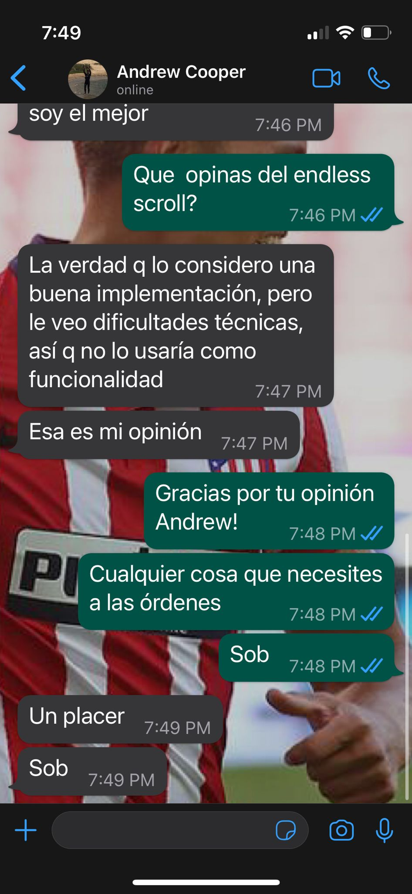

# Validación de la solución
Para validar la solución y verificar que el proyecto sea viable, decidimos otorgarle la documentación junto con los bocetos a compañeros de confianza.
## Consulta externa: Mercedes Torrendell
Mercedes, que tiene afinidad por la tecnología y desarollo de software cree que el proyecto está bien estructurado, y que la solución es correcta.

También se tomó el tiempo de sugerir posibles implementaciones a los requisitos funcionales. Fue idea de Mercedes crear un sistema de favoritos de NFTs para posteriormente crear una especie de feed en donde podamos ver los NFTs con más favoritos.

## Consulta externa: Andrew Cooper
Andrew, estudiante de Ing. en Sistemas y compañero nuestro de facultad, cree que el proyecto y nuestra solución están correctos. Cuando Andrew recibió la documentación, dentro de los requisitos funcionales se encontraba la función de "endless scroll", que utilizan apps como Instagram y TikTok. Andrew lo consideró una buena implementación, pero admitió posibles dificultades técnicas, por lo que aconsejó no priorizarlo como funcionalidad. Decidimos seguir su consejo y no incluirlo dentro de los requisitos funcionales, e implementarlo a futuro si el tiempo y la complejidad lo permiten.

Evidenciación:

