# Informe académico entrega 2
Fecha de entrega: 27-jun-2022

## Construcción

### Implementación de funciones principales (sin la necesidad de persistencia de datos)

La implementación de las funciones principales es visible en el archivo [index.js](interfaz/scripts/index.js). En este archivo son visibles variedad de funciones de JavaScript que le dan funcionalidad a las funciones prinipales:
- Login
- Agregar NFT a Feed (mediante un import de .jpg)
- Agregar NFT a Favoritos

Debido a restricciones en nuestro conocimiento, no logramos integrar a tiempo la funcionalidad de comprar un NFT, cómo tampoco varias otras funciones detalladas en la planeación del proyecto y la documentación inicial.

### Configuración de plataforma tecnológica para desarrollo y producción
Plataforma de Desarollo: Visual Studio Code (v1.68.1) + Extensiones:
- ESLint
- HTML CSS Support
- Live Share
- Markdown All in One
- vscode-pdf

### Documentación del uso de librerías externas (package.json)

Para el desarrollo del proyecto, variedad de librerías externas fueron utilizadas. Podemos diferenciar entre interfaz y dominio para estas librerías:

Interfaz:
- @material/snackbar": "^12.0.0" → Da mensajes breves sobre los procesos de la aplicación en la parte inferior de la pantalla
- material-components-web": "^11.0.0 → Componentes modulares y personalizables de la interfaz de usuario de Material Design
- @babel → Se utiliza para convertir el código en una versión retrocompatible de JavaScript en entornos actuales y antiguos
- autoprefixer → Facilita el desarrollo de CSS
- css-loader → Módulo del npm que recopila todos los archivos del CSS para ayudar al webpack
- eslint →Implementa la herramienta “eslint” para identificar e informar sobre patrones encontrados en el código, con el objetivo de hacer que el código sea más consistente y evitar errores
- extract-loader, file-loader, postcss-loader → Se utilizan para el funcionamiento del webpack
- sass → Permite compilar de forma nativa archivos SCSS a CSS
- sass-loader → Permite al webpack compilar archivos SCSS
- webpack, webpack-dev-server → Se utilizan para compilar módulos de Javascript
- webpack-cli → Facilita el desarrollo y configuración de un nuevo webpack

Dominio:
- eslint → Implementa la herramienta “eslint” para identificar e informar sobre patrones encontrados en el código, con el objetivo de hacer que el código sea más consistente y evitar errores (igual que para interfaz)
- eslint-config-google → Configuración de eslint para utilizar el google style guide
- jest → Permite escribir y ejecutar tests en JavaScript

## Interfaz de usuario

### Interfaz de usuario web / mobile (responsive)

Screenshots de la interfaz de usuarios:

Tamaño adaptado a Web:

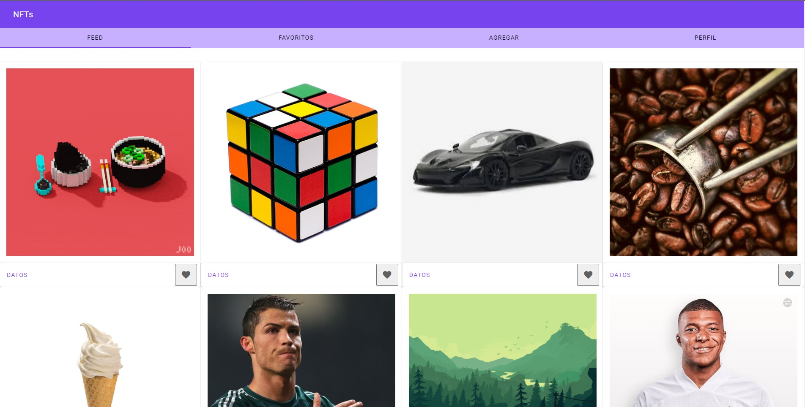

Tamaño adaptado a Mobile:

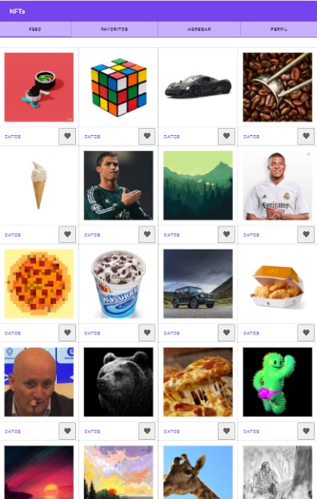

Tamaño adaptado a Tablet:

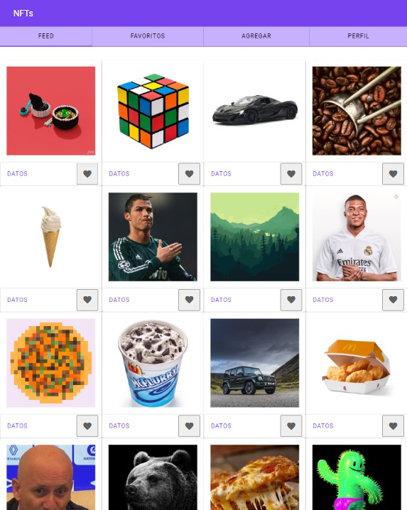

### Página única con navegación entre secciones

 La interfaz de usuario es una página única con navegación mediante tabs, diseñada con Material Design Web Components en su tercera y última versión, y responsive, adaptando el contenido a dispositivos de cualquier tamaño. A continuación se muestran capturas de pantalla ilustrando estas características y mostrando gran parte de la forma en que se muestran las funcionalidades del marketplace.

Tab de Feed:

Tab de Agregar:

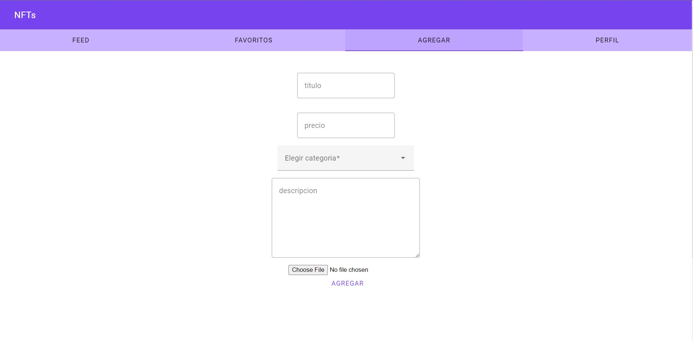

### Implementación: Material Design Web Components

Utilzamos la implementación de Material Design 3 principalmente para el diseño de las Tabs, las Cards (Portan el NFT con sus datos), y los botones, entre otros.

Ejemplo de una MDC Card:

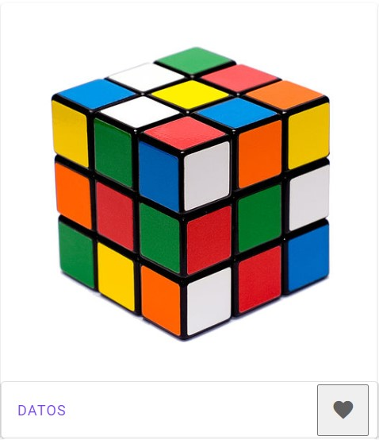

El resto de los elementos utilizados son visibles en las capturas de pantalla de interfaz. Cabe destacar que intentamos utilizar los MDC Dialogs para mostrar información sobre los NFT, como también alertas de validación de datos, pero nos vimos limitados en nuestro conocimiento sobre cómo implementar Material Design, por lo que recurrimos al sistema de alertas de JavaScript:

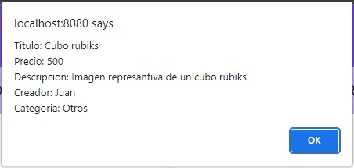

### Aplicar un sistema de diseño y principios de usabilidad

- Diseño práctico y minimalista.
- Visibilidad del estado del sistema, indicar en todo momento dónde está parado el usuario. Esto es indicado por los colores de las tabs.
- Notifica errores claramente, como se puede ver en los siguientes ejemplos:

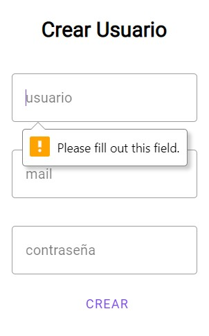

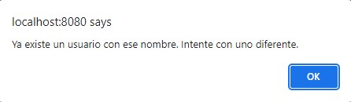

- Consistencia en el lenguaje visual, toda la página mantiene su estilo gracias a MDC que hace que los componentes sean homogéneos.
- Lenguaje acorde a los estándares usados en páginas web, como “login”, “feed”, “perfil”...

### Cumplimiento de estándar de accesibilidad WCAG

- Perceptibilidad: se requiere una descripción para poder ingresar un NFT, proporcionando alternativas textuales para aquellos que la necesiten.
- Operabilidad: el usuario se puede tomar el tiempo que necesite para utilizar la web. A su vez la interfaz es sencilla y sus componentes son grandes, facilitando la navegación. 
- Comprensibilidad: el contenido es textual, legible y comprensible.
- La apariencia y operabilidad es predecible.

### Seguir especificación de estilo

Se cumplieron los estándares de estilo detallados en la letra del obligatorio: el tipo de letra es Roboto, los íconos están filled, el nombre de la app es NFTs y los colores primarios y secundarios fueron seleccionados de https://material.io/resources/color.

## Codificación

### IDE Visual Studio Code: configuración común del equipo

El equipo usó IDE Visual Studio Code para la codificación del proyecto, junto con las extensiones mencionadas anteriormente. Cómo herramienta de versionado, se utilizó GitHub. En GitHub, se usaron dos branches: staging y main para diferenciar entre producción y desarrollo.

### Estándares de codificación Google (HTML, CSS, JavaScript)

Los estándares de codificación a seguir fueron los de Google, para HTML, CSS y JavaScript. Se utilizó eslint.js, que puede configurarse para realizar el análisis estático del código siguiendo el estilo de codificación de Google.

Ejemplos de uso de ESLint: 

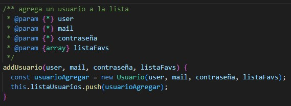

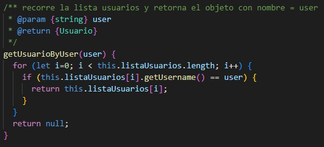

### Buenas prácticas de OOP: separación de lógica e interfaz

La separación entre lógica e interfaz es visible en los directorios [dominio](dominio/) e [interfaz](interfaz/)

## Test unitario

### Test unitarios en Jest

Debido a restricciones de tiempo y compatibilidad, no logramos realizar las pruebas unitarias mediante Jest.

### Code Freeze

En la semana previa a la entrega se debe congelar el desarrollo (22-jun-2022).
A partir de este punto solo se realizan actividades de test de sistema, reporte de issues y generación del informe académico. [Último commit](https://github.com/juanmolinolo/molinolo-bervejillo-perrier/commits/staging) (exceptuando documentación y merge a main):

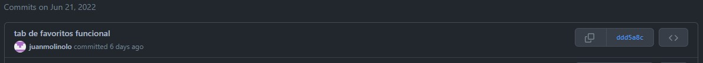

## Test de sistema

### Detallar sesiones de prueba exploratoria

Hicimos sesiones de prueba exploratorias ya con el código congelado. Detallamos a continuación las siguientes instancias de testing exploratorio:

#### Sesión 1

- Tiempo: corta
- Objetivo: validar que la gramática es correcta en todo el sitio
- Notas:
  - La página es del todo comprensible y no tiene errores grandes de ortografía
  - Faltan tildes en casi todas las instancias que se hace uso de las palabras: categoría, música, fotografía, título y descripción

#### Sesión 2
- Tiempo: corta
- Objetivo: validar el funcionamiento de los usuarios: que no puedan haber dos con el mismo username, que solo loguee a usuarios que ponen correctamente su contraseña
- Notas:
  - Se intentó crear tres perfiles con el username “juan”, solo admitió el primero
  - Se intentó ingresar a “juan” con la contraseña incorrecta, no nos dejó
  - Se intentó ingresar a “juan” con la contraseña de otro usuario, no nos dejó
  - Se ingresó a “juan” con su debida contraseña
  - Se ingresó a “mili” (el otro perfil creado) con su debida contraseña. El cambio de usuario se hizo sin problema

#### Sesión 3
- Tiempo: corta
- Objetivo: validar que sea posible agregar un NFT y que se agregue con todos los datos correctos
- Notas:
    - Se agregó fácil y correctamente, el NFT aparece al fondo del feed con todos los datos correctos
    - Observación: la categoría Música se muestra como musica (sin mayúscula ni tilde), podría cambiarse

#### Sesión 4
- Tiempo: corta
- Objetivo: añadir un NFT a Favoritos (estando logueado en un usuario)
- Notas:
    - Se agregan sin problema
    - Cuando intento agregar el mismo dos veces el sistema no me lo permite y me lo alerta correctamente
    - Problema con la pestaña de favoritos: los NFTs se muestran más pequeños que en el feed
    - Cuando llega a 8 NFTs en favoritos el tamaño de arregla
    - El botón “datos” no funciona en la pestaña favoritos
    - No se pueden quitar los NFTs de favoritos una vez que fueron agregados

## Reporte de issues

El equipo reportó issues y posibles mejoras en GitHub, algunos de los cuales quedaron abiertos incluso luego del code freeze. Al tener sesiones de codificación largas en las que se resolvieron muchos problemas en conjunto, los issues reportados no son muchos. Si la metodología de trabajo hubiese sido con intervalos más cortos (por ejemplo, codificar solamente una hora por día), probablemente el equipo hubiera reportado más issues porque quedarían muchas cosas que resolver tras cada sesión.
Issues que quedaron abiertos:

Ejemplos:

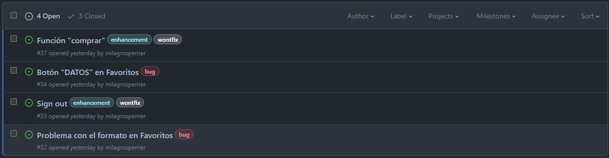

## Reflexión

### Reflexión individual: Milagros
Lo que más me llevo de este proyecto, personalmente, es el haber seguido adquiriendo conocimientos de GitHub como el reporte de issues y trabajar de una nueva forma con branches, y de conceptos y técnicas de testing. Son conocimientos prácticos que me serán muy útiles a futuro y con los que podré trabajar si profundizo un poco más en ellos. También pudimos aplicar a nuestra página los principios de usabilidad que vimos en el curso, y hacerla ya pensando en los principios de usabilidad.
Sin embargo, me hubiese gustado que el proyecto se enfoque más en la aplicación y evaluación de estos conceptos. En el proyecto actual tuvo mucho peso la codificación, a diferencia de en el curso en el que no nos enfocamos principalmente en el uso de node y MDC. Nos faltó conocimiento práctico en los lenguajes usados para hacer todo 100% como habíamos planeado, nos tuvimos que enfocar más de lo que se esperaba en la parte de codificación y gastamos mucho tiempo que debería haber sido gastado en tests y evaluación de usabilidad en eso. Para poder hacer esta propuesta sin problemas, deberíamos haber tenido más contenido práctico durante el semestre: hacer algunos ejercicios de node o de aplicación de MDC.

### Detalle del trabajo individual: Milagros
Mi aporte en el trabajo de equipo fue distribuido por todas las partes del proyecto. Como equipo, no nos asignamos tareas sino que fuimos avanzando en las tareas del momento, de modo que todos hicimos frontend, backend y documentación. Si tuviera que especificar en qué contribuí más sería al inicio del proceso de codificación de la página (ya que hacia el final de la codificación de la página tuve complicaciones de salud y no pude estar tan presente como me hubiese gustado), y a la documentación final.

### Reflexión individual: Juan Bautista
Personalmente creo que este proyecto fue un poco desafiante de más, debido a que nos hicieron programar con herramientas nuevas sin ningún tipo de enseñanza previa, o alguien a quien consultarle dudas. Esto me generó un cierto rechazo a la materia, ya que me sentaba a programar y no entendía la mayoría de las cosas, y viendo cuales eran los objetivos de esta materia, creo que tuvimos que dedicar gran parte del tiempo en cosas que no eran tan relevantes. 
Me molestó mucho no poder entregar un trabajo terminado, ya que eso no refleja la cantidad de horas que le dedicamos al proyecto, siento como que el nivel de este obligatorio era superior al nuestro, y no había mucho que pudiéramos hacer para poder entregar todo el trabajo terminado y como planeamos. 
Pero, centrándome en lo positivo que me llevo de este obligatorio, creo que logré aprender a utilizar grandes cosas como git o a hacer tests, que me van a ser muy útiles a lo largo del tiempo. Estos son los puntos buenos que logré sacar de este trabajo, y considero que me aportan conocimientos importantes sobre full stack y la programación en general. 
En relación al trabajo en equipo, estoy muy contento con el trabajo que hicimos todos, ya que nunca hubo discusiones o ningún tipo de problema a la hora de realizar el proyecto, siempre logramos organizarnos y trabajar muy bien todos. Esto fue clave para todos los momentos en los que se nos dificultó la parte de programar. 

### Detalle del trabajo individual: Juan Bautista
En relación a los aportes sobre este obligatorio, siento que en general todos realizamos un trabajo bastante similar. Cada uno le dedicaba un rato por su cuenta y luego lo complementamos con reuniones para poder seguir todos juntos. De esta forma todos logramos trabajar en todo. Por mi parte, mis habilidades sobre node.js a la hora de programar no eran muy buenas, por lo que tal vez me perdía un poco en las partes más complejas de esto, pero pude colaborar un poco más en la documentación y desarrollo de front end. De esta forma logré contribuir al equipo con lo que mejor se me dio a la hora de enfrentar el obligatorio.

### Reflexión individual: Juan Andrés
Pienso que el resultado final es satisfactorio. No estoy de acuerdo en cómo está ideado el obligatorio. Si el objetivo del proyecto es evaluar aprendizajes de clase, no considero que esta sea la mejor manera. Tanto las limitaciones de tiempo y habilidad lograron que el enfoque sea en el código y desarrollo del proyecto, y no en aplicar el téorico de clase. Nos enfrentamos a varias complicaciones en las dependencias del proyecto, las cuáles llevaron la mayoria de nuestro tiempo en resolver. Me importa más que nada destacar que el uso de la libreria Webpack generó muchisimos problemas con el resto de las dependencias, e incluso no nos permitió instalar Node.js a principios del desarrollo debido a una incompatibilidad con la versión más reciente. Esto fue solucionado instalando una versión bastante anterior para poder empezar la codificación. También tuvimos problemas instalando Jest, por lo que no pudimos realizar las pruebas unitarias.
Continuando, aunque entiendo que el uso de Material Design para la interfaz gráfica es una buena manera de implementar una interfaz uniforme y de buena usabilidad, la documentación de los componentes es muy limitada para plataformas Web, por lo que no pudimos implementar algunos de los componentes que en un inicio decidimos usar, y los que si logramos implementar llevaron demasiado tiempo de desarrollo. A pesar de todo esto, considero que el producto final es bastante satisfactorio. Después de ver las defensas de mis compañeros, veo que somos de los pocos grupos que tiene una plataforma con un backend funcional.

### Detalle del trabajo individual: Juan Andrés
Aunque el proyecto fue realizado en grupo y cada participante tuvo grandes aportes, considero que tuve más presencia en el desarrollo de código. Realicé gran parte del backend. Por otra parte, mis aportes de frontend fueron pocos. También, debido a experiencia previa con GitHub, fui yo quién aseguro el correcto manejo de ramas, y me aseguré que el resto de los integrantes sepa cómo utilizar la herramienta de versionado.